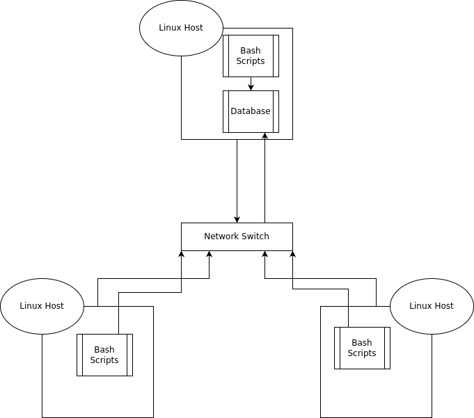

# Introduction

This project is a Cluster Monitoring Agent that will gather information on server resource usage and hardware specifications within a Linux cluster and automatically insert it into a database for quick and easy viewing.

# Quick Start Guide

```
- Start a psql instance using the psql_docker.sh script
    - psql_docker.sh start
- Create the necessary table using ddl.sql
    - psql -h $host_name -U $username -d $db_name -f sql/ddl.sql
- Insert hardware specs into the database using host_info.sh
    - bash scripts/host_info.sh $psql_host $psql_port $db_name $psql_user $psql_password
- Insert usage data into the database using host_usage.sh
    - bash scripts/host_usage.sh $psql_host $psql_port $db_name $psql_user $psql_password
- Set up automated usage scraping using a crontab
```

# Implementation

The agent was implemented in a Google Cloud Platform (GCP) compute instance running rocky linux 9 and was implemented using the following:

* Docker (Containerization)
* Linux command line
* PosgreSQL (psql) databases
* Bash scripts
* Cron for automated execution of scripts

## Data Collection Scripts

* `host_info.sh` is a singleton script that will gather hardware information of the host computer, such as CPU type, memory, hostnames, etc.
* `host_usage.sh` will run every minute using `cron` and collect necessary usage information such as kernel idle times, available space, and CPU / memory utilization.
* `psql_docker.sh` consists of 3 different functionalities: `start`, `stop`, and `create`. `create` will generate a docker container with our postgres volume, while `start` and `stop` will do just that to our docker container.
* The crontab script will run host_usage.sh every minute while creating an output to a log file.
* `ddl.sql` is the script that will generate the database for data collection. It contains the schema of both databases.

## Architecture



## Database Modelling

`host_info`

| Column Name  | Data Type    | Description                                     |
| ---    | ---   |-------------------------------------------------|
| `id` | `SERIAL`(PK) | Used for uniquely identifying clusters          |
| `hostname` | `VARCHAR`(UQ) | The name of the cluster                         |
| `cpu_number` | `INT2` | The number of CPU cores on the host machine     |
| `cpu_architecture` | `VARCHAR` | The architecture of the CPU                     |
| `cpu_model` | `VARCHAR` | The model of the CPU                            |
| `cpu_mhz` | `FLOAT8` | The speed at which the CPU runs, in MHz         |
| `l2_cache` | `INT4` | The amount of space CPU cache has               |
| `"timestamp"` | `TIMMESTAMP` | The time the data was scraped                   |
| `total_mem` | `INT4` | The total memory allocation of the host machine |

`host_usage`

| Column Name  | Data Type    | Description       |
| ---    | ---   | ---     |
| `"timestamp"` | `TIMESTAMP` | The time the data was scraped |
| `host_id` | `SERIAL`(FK) | Used for uniquely identifying clusters |
| `memory_free` | `INT4` | The amount of available memory, in MB |
| `cpu_idle` | `INT2` | The CPU idle percentage |
| `cpu_kernel` | `INT2` | The kernel idle percentage |
| `disk_io` | `INT4` | Disk idle percentage |
| `disk_available` | `INT4` | Available disk space on the machine in MB |

# Test

* `host_info.sh` and `host_usage.sh` were extensively tested using various `echo` checks to see if proper data was being passed to the docker commands. `bash -x` was used to check all variables and lines of output in the script.
* `ddl.sql` was fed mock data to ensure relationships within and between the databases were set up properly
* The results of the extensive testing showed that all tests were passed and referential integrity was upheld.

# Deployment

* Deployment was done through GitHub, where all source files are hosted, allowing easy updates across machines.
* Crontab was set up for automation on each host machine.
* Docker was used for easily hosting a PostgreSQL instance
* Manual script execution was required for `host_info.sh` so that `host_usage.sh`could find the host id.

# Improvements

* Script redundancy improvements
    * Create universal functions for scraping host information to lessen script redundancy in `host_info.sh` and `host_usage.sh`
* Add extensive error logging
        * As of now, if a script fails, it's hard for the user to know when it happened. Adding a parser to log files to ensure no errors were encountered would help greatly in minimizing risks and faults.
* Lockdown database credentials
    * Passwords for users are stored in environment variables, which is not exactly the most secure way to go about it. Using Docker secrets would help immensely with information security
* Handle hardware updates
    * `host_info.sh` only runs once. If a host computer were to be upgraded either with a new CPU, disk, memory, etc, changes would not be reflected in the databases.