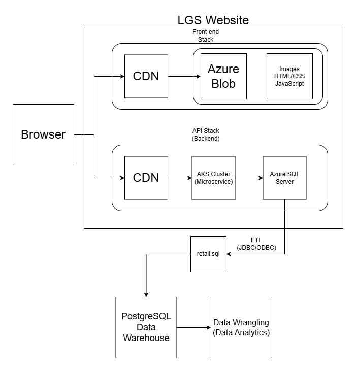

# Introduction

This project aims to analyze a retail dataset to help London Gift Shop (LGS), a UK-based wholesaler, which has run into financial stagnation from low growth over the years. The business context revolves around understanding customer behaviour and preferences, enabling LGS to tailor their offerings more effectively.

The CTO decided to engage with Jarvis consulting software and data engineering services to deliver a proof of concept (PoC) project to help the marketing team by analyzing customer shopping behavior. Jupyter Notebook was used for data exploration, Python libraries such as pandas, numpy, matplolib for data wrangling and visualization, and leveraging common analytical techniques like RFM was used to create data insights. This project is integrated with LGS's backend API, allowing for seamless data-driven decision-making.

## Implementation

### Project Architecture Diagram

### Data Analytics and Wrangling

To access the Jupyter notebook for data analytics and wrangling, click [here](./retail_data_analytics_wrangling.ipynb).

The data is used for
1. **Customer Segmentation**: Grouping customers based on their purchasing behavior to identify high-value segments.
2. **Trend Analysis**: Identifying trends in sales and identifying potential growth opportunities.
3. **Promotion Optimization**: Designing targeted marketing campaigns that are likely to drive increased revenue.

## Components

- **Customers**: End-users interacting with the LGS website.
- **LGS Website**: Web application where customers place orders, view products, and access services.
- **Data Warehouse**: Centralized storage for customer data, order history, and inventory details.
- **Python Data Analytics Project**: Backend component for data processing, analysis, and insight generation.

## Flow of Data

1. Customers interact with the LGS Website.
2. The LGS Website sends data (e.g., orders, customer info) to the Database.
3. The Python Data Analytics Project queries the Database for necessary data.
4. In the Python Data Analytics Project:
    - Data is processed and transformed.
    - Analysis is performed (e.g., customer segmentation, sales trends).

## Improvements

If more time allocated to the PoC, the following improvements could be made:
1. **Advanced Segmentation**: Introduce additional dimensions for customer segmentation (e.g., geographic location, age) to gain deeper insights.
2. **Predictive Modeling**: Implement predictive models and machine learning to forecast future sales and identify potential risks.
3. **Real-time Analytics**: Integrate real-time data streaming capabilities to monitor business performance in near real-time.