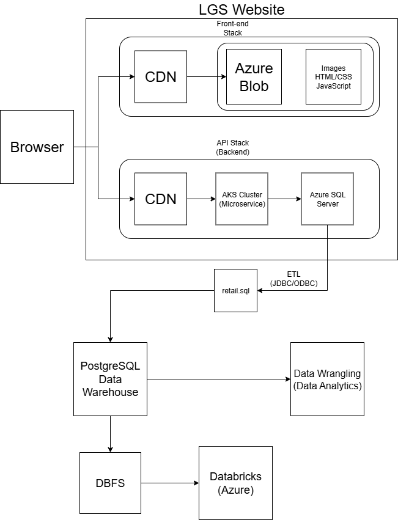
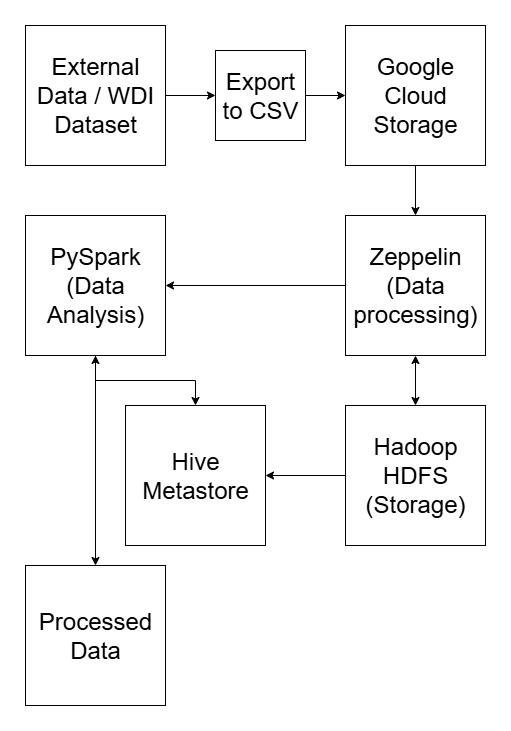

# Introduction
This project aims to analyze a retail dataset to help London Gift Shop (LGS), a UK-based wholesaler, which has run into financial stagnation from low growth over the years. The business context revolves around understanding customer behaviour and preferences, enabling LGS to tailor their offerings more effectively.

The CTO decided to engage with Jarvis consulting software and data engineering services to deliver a proof of concept (PoC) project to help the marketing team by analyzing customer shopping behavior. Databricks, PySpark and other Azure Services were used for data exploration, data wrangling, and data visualization. This project is integrated with LGS's backend API, allowing for seamless data-driven decision-making.

# Databricks and Hadoop Implementation

The full notebook can be found [here](notebook/retail_data_analytics_wrangling.ipynb)

The dataset used in thhis project contains key metrics such all customer orders, quantities, prices, etc. which has been extensively processed to find key performance indicators that allow customers to be grouped into special categories for targeted marketing campaigns. PySpark on Databricks was utilized for data processing, aggregation, and analysis to efficiently query data.

# Zeppelin and Hadoop Implementationgit st
We utilized Hive and PySpark to perform analytics on a WDI dataset and visualize the results in Apache Zeppelin notebook running on a Google Cloud Platform Hadoop cluster which can be found [here](notebook/WDIDataAnalytics.json)

# Future Improvement
1. Optimizing Data storage and Processing
2. Scalability and Performance Enhancements
3. Advanced Data Analytics and Machine Learning